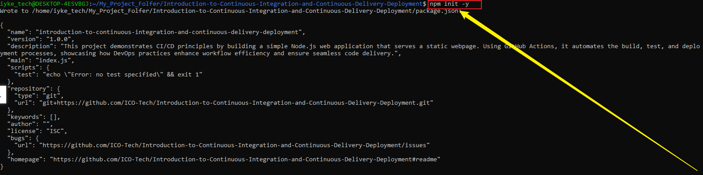
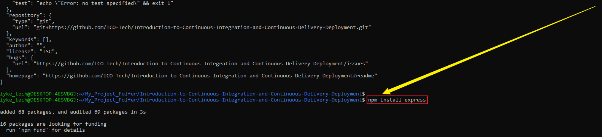
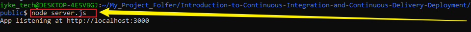

# Introduction-to-Continuous-Integration-and-Continuous-Delivery-Deployment
```
This project demonstrates CI/CD principles by building a simple Node.js web application that serves a static webpage. Using GitHub Actions, it automates the build, test, and deployment processes, showcasing how DevOps practices enhance workflow efficiency and ensure seamless code delivery.
```
## GitHub Actions and CI/CD
```
Welcome to the GitHub Actions and Continuous Integration/Continuous Deployment (CI/CD), a comprehensive, hands-on journey into the world of software automation and modern DevOps practices. In this short project, you’ll explore how GitHub Actions simplifies the automation of your software development lifecycle — from code integration and automated testing to deployment across different environments. You’ll gain a step-by-step understanding of how workflows are created, triggered, and managed directly within your GitHub repositories.
```
```
This project-based learning experience, you will:
```
 - Learn the fundamentals of CI/CD and its importance in modern development.
 - Build and customize GitHub Actions workflows to automate repetitive development tasks.
 - Integrate testing, build, and deployment pipelines for real-world applications.
 - Understand how automation improves code quality, accelerates delivery, and enhances collaboration.
```
Whether you’re a developer, student, or an IT professional seeking to strengthen your DevOps skills, this simple project will equip you with the practical knowledge, confidence, and experience needed to design and implement efficient CI/CD pipelines using GitHub Actions in your own projects.
```
## Takeway 1: Understanding Continuous Integration and Continuous Deployment

## Definition and Benefits of CI/CD
  
- Continuous Integration (CI) is a development practice where developers frequently merge their code changes into a shared repository — often multiple times a day. Each integration triggers an automated build and test process, ensuring that new code works well with the existing codebase and helping detect errors early.

- Continuous Deployment (CD) takes automation a step further by automatically deploying tested code to production or live environments. This ensures that new features, bug fixes, and updates reach users quickly and reliably without manual intervention.

## Benefits of CI/CD:

- Faster Release Cycle: Software updates are delivered more frequently and efficiently.
- Higher Developer Productivity: Automation reduces repetitive manual work, allowing developers to focus on coding and innovation.
- Improved Code Quality: Continuous testing helps identify and fix issues early in the process.

Better Customer Satisfaction: Frequent, reliable updates lead to a smoother user experience and faster access to new features.

## Overview of the CI/CD Pipeline
```
A CI/CD pipeline is an automated workflow that manages how software moves from development to deployment. It ensures every code change is tested, built, and delivered systematically.
```
## CI Pipeline:
```
This part of the process includes steps like version control (using Git), code integration, automated testing, and building the application into deployable artifacts (e.g., Docker images or compiled binaries).
```
## CD Pipeline:
```
Once the application is built and tested, the CD pipeline handles deployment. It automates releasing the application to staging (testing) and production environments. It may also include post-deployment checks like performance monitoring and rollback mechanisms in case of errors.
```
## Common Tools Used:

- Version Control: Git, GitHub
- CI/CD Platforms: GitHub Actions, Jenkins, GitLab CI.
- Testing Frameworks: Jest, PyTest, JUnit.
- Deployment Tools: Docker, Kubernetes, AWS, Azure, or other cloud platforms.
```
In short, CI/CD pipelines form the backbone of modern DevOps, ensuring software is built, tested, and delivered quickly, consistently, and with minimal human effort.
```
## Takeawy 2: Introduction to GitHub Actions

## Understand GitHub Actions
```
GitHub Actions is a built-in CI/CD platform within GitHub that helps automate tasks like building, testing, and deploying your software directly from your repository. It allows you to create automated workflows that respond to events such as code pushes or pull requests.
```
## Key Concepts and Terms

## Workflow

- `What it is:` A workflow is an automated process made up of one or more jobs.
- `Where it’s defined:` In a YAML file inside your repository (usually in `.github/workflows/)`.
- `Example:` Running tests and deploying a Node.js app whenever you push code to GitHub.

## Event

- `What it is:` An activity that triggers a workflow.
- `Examples:` Code push, pull request, issue creation, or a scheduled time trigger.
- `Example:` A workflow runs tests automatically whenever code is pushed to a branch.

## Job

- `What it is:` A collection of steps that run on the same machine (called a runner).
- `How it runs:` Jobs can run one after another or at the same time.
- `Example:` A job that runs automated tests on your code.

## Step

- `What it is:` A single task inside a job — it can run commands or use pre-built actions.
- `Example:` Installing project dependencies with npm install.

## Action

- `What it is:` A reusable piece of code that performs a specific task in a workflow.
- `Examples:` actions/checkout → checks out your code from GitHub and actions/setup-node → sets up Node.js for your workflow.

## Runner

- `What it is:` The server that runs your workflow jobs.
- `Types:`
    - GitHub-hosted runners (like Ubuntu, Windows, or macOS).
    - Self-hosted runners (your own servers or machines).
- Example: Using an Ubuntu runner to execute your workflow tasks.

## Practical Implementation
## Setting Up the Project:

## Initialize a GitHub Repository:
- Create a new repository on GitHub.
- Clone it to your local machine.

## Create a Simple Node.js Application:
- Initialize a Nodejs project ('pm init').




- Create a simple server using Express.js to serve a static web page.



- Add your code to the repository and push it to GitHub.
    - Create a main server i.e. server.js
    ```
    touch server.js
    ```
    - Create a folder for your static web page.
    ```
    mkdir public
    ```
    - Inside the public folder, create a simple index.html file.
    ```
    echo "<h1>Welcome to My Node.js App!</h1>" > index.html
    ```
- Open your server.js script and paste your code
```
// Example: index.js
const express = require('express');
const app = express();
const port = process.env.PORT || 3000;

app.get('/', (req, res) => {"\n     res.send('Hello World!');\n   "});

app.listen(port, () => {
  console.log(`App listening at http://localhost:${port}`);
});
```
- Run Your Server



   

